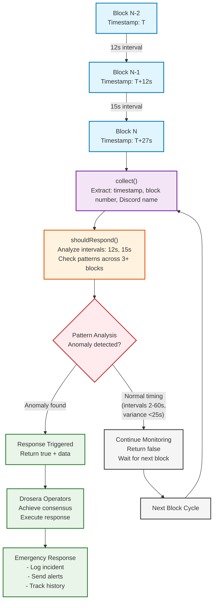

# Block Time Anomaly Detector

A novel infrastructure level security trap for Drosera Network

## Overview

The Block Time Anomaly Detector is the first Drosera trap to monitor blockchain infrastructure health at the consensus layer. While other traps focus on application specific threats, this trap detects network-wide issues that could affect all protocols and users.

**Deployed Contracts:**
- **Trap Contract:** `0x499684111e2edeec86e8f9007bd3de66c7c0f854`
- **Response Contract:** `0x93a0a66E12dB8278e21c5f59295d43c535093cF6`

## What It Detects

| Anomaly Type | Description | Threshold | Risk Level |
|-------------|-------------|-----------|------------|
| Too Slow | Block intervals >60 seconds | Network congestion/issues | High |
| Too Fast | Block intervals <2 seconds | Timestamp manipulation | Critical |
| High Variance | >25s difference between consecutive intervals | Network instability | Medium |
| Stalled | Multiple consecutive slow blocks (>36s each) | Consensus problems | Critical |

## How It Works



### Multi Pattern Detection Logic

The trap analyzes **consecutive block sequences** to identify four distinct anomaly patterns:

- **Too Slow Detection**: Intervals > 60 seconds indicate network congestion or consensus issues
- **Too Fast Detection**: Intervals < 2 seconds suggest timestamp manipulation or attacks  
- **Variance Analysis**: Swings > 25 seconds between consecutive intervals reveal instability
- **Stalling Detection**: Multiple blocks > 36 seconds signal critical network failures

Unlike simple threshold monitoring, this **multi pattern approach** provides:
- **Context aware analysis** across 3+ consecutive blocks
- **Reduced false positives** through pattern-based validation
- **Comprehensive coverage** of both sudden shocks and gradual degradation

## Detection Algorithm

1. **Data Collection**: Captures block timestamps and numbers every block
2. **Interval Calculation**: Computes time differences between consecutive blocks
3. **Pattern Analysis**: Analyzes timing patterns across 3+ blocks
4. **Anomaly Classification**: Categorizes detected anomalies by type and severity
5. **Response Triggering**: Activates emergency protocols for severe anomalies

## Quick Deploy

### Prerequisites

**Install Drosera CLI**
```bash
curl -L https://install.drosera.io | bash
source ~/.bashrc
```

**Install Foundry**
```bash
curl -L https://foundry.paradigm.xyz | bash
foundryup
```

**Get Hoodi testnet ETH**
Visit: https://faucet.hoodi.io

### One-Click Deployment

**Clone repository**
```bash
git clone https://github.com/Idle0x/block-time-anomaly-trap
cd block-time-anomaly-trap
```

**Set your private key**
```bash
export PRIVATE_KEY=0xyourprivatekey
export DROSERA_PRIVATE_KEY=$PRIVATE_KEY
```

**Run automated deployment**
```bash
chmod +x script/deploy.sh
./script/deploy.sh
```

### Manual Deployment

1. **Compile contracts**
```bash
forge build
```

2. **Deploy contracts**
```bash
forge script script/Deploy.s.sol --rpc-url https://ethereum-hoodi-rpc.publicnode.com --broadcast
```

3. **Update drosera.toml with response contract address**

4. **Deploy to Drosera**
```bash
drosera apply
```

5. **Test deployment**
```bash
drosera dryrun
```

6. **Hydrate with rewards**
```bash
drosera hydrate --trap-address 0x499684111e2edeec86e8f9007bd3de66c7c0f854 --dro-amount 10
```

## Monitoring & Testing

### Run Tests

**Run comprehensive test suite**
```bash
forge test -v
```

**Run specific test**
```bash
forge test --match-test testDetectsTooSlowAnomaly -v
```

### Monitor Activity

**Check trap status**
```bash
drosera status --trap-address 0x499684111e2edeec86e8f9007bd3de66c7c0f854
```

**Watch for anomaly events**
```bash
cast logs --rpc-url https://ethereum-hoodi-rpc.publicnode.com --address 0x93a0a66E12dB8278e21c5f59295d43c535093cF6
```

**Check network health**
```bash
cast call 0x93a0a66E12dB8278e21c5f59295d43c535093cF6 "isNetworkHealthy()" --rpc-url https://ethereum-hoodi-rpc.publicnode.com
```

## Why This Trap is Unique

### Novel Approach
- **Infrastructure level monitoring**: Unlike other traps that only monitor applications deployed by protocols; this monitors the blockchain itself
- **Consensus layer security**: Detects issues that could affect the entire network
- **Multi pattern analysis**: Sophisticated timing analysis beyond simple thresholds

### Technical Excellence
- **Zero dependencies**: Works on any blockchain without external contracts
- **Robust validation**: Comprehensive input validation and error handling
- **Complete test coverage**: Full test suite with edge cases
- **Production ready**: Proper access controls and emergency handling

### Real Value
- **Early warning system**: Detects network issues before they affect applications
- **Infrastructure monitoring**: Critical for network health and validator accountability
- **Historical tracking**: Maintains complete anomaly history for analysis

## Project Structure

```
block-time-anomaly-trap/
├── README.md                    # This file
├── LICENSE                      # MIT License
├── foundry.toml                 # Foundry configuration
├── drosera.toml                 # Drosera trap configuration
├── src/
│   ├── BlockTimeAnomalyTrap.sol # Main trap contract
│   └── BlockAnomalyResponse.sol # Response handler
├── script/
│   ├── Deploy.s.sol             # Foundry deployment script
│   └── deploy.sh                # Automated deployment
├── test/
│   └── BlockTimeAnomalyTrap.t.sol # Comprehensive tests
└── deployment/
    ├── DEPLOYMENT.md            # Deployment log
    └── addresses.json           # Contract addresses
```

## Links

- **Live Trap**: [Drosera App](https://app.drosera.io)
- **Hoodi Etherscan**: [hoodi.etherscan.io](https://hoodi.etherscan.io)
- **Drosera Network**: [drosera.io](https://drosera.io)
- **Documentation**: [docs.drosera.io](https://docs.drosera.io)

## Contributing

This project demonstrates infrastructure level blockchain security monitoring. Feel free to:

- Fork and improve the detection algorithms
- Add new anomaly patterns
- Suggest threshold optimizations
- Report issues or bugs

---
- **Author**: idle0x
- **Network**: Hoodi Testnet (Chain ID: 560048)
- **Status**: Deployed and Active
- **Category**: Network Health Monitoring
